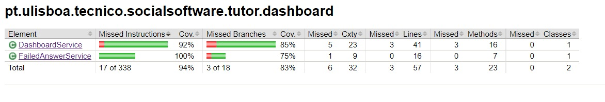

# ES22 P1 submission, Group 28
## Feature PRI
### Subgroup
- Alexandra Rodrigues, Xanatc
  - Issues assigned: #3, #15, #10, #43, #44, #20
- Alexandra Pato, AlexP-Coding
  - Issues assigned: #6, #8, #45, #46, #18

### Pull requests associated with this feature
The list of pull requests associated with this feature is:
- PR #33

### Test Coverage Screenshot
The screenshot includes the test coverage results associated with the new/changed entities:

## Feature ERE
### Subgroup
- Carlos Amaro, LordKubaya
  - Issues assigned: #2, #5, #17, #21, #27, #28, #29, #49
- Miguel Carvalho Pereira, miguelcarvalhopereira
  - Issues assigned: #23, #28, #29

### Pull requests associated with this feature
The list of pull requests associated with this feature is:
- PR #30

### Test Coverage Screenshot
The screenshot includes the test coverage results associated with the new/changed entities:

## Feature PRD
### Subgroup
- Pedro Tavares da Silva, pqts
  - Issues assigned: #11, #12, #13, #14, #19, #24, #25, #26, #34, #35
- Gonçalo Correia, layko88
  - Issues assigned:

### Pull requests associated with this feature
The list of pull requests associated with this feature is:
- PR #38

### Test Coverage Screenshot
The screenshot includes the test coverage results associated with the new/changed entities:

