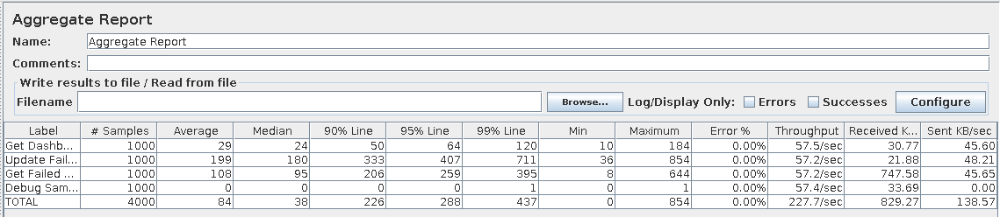
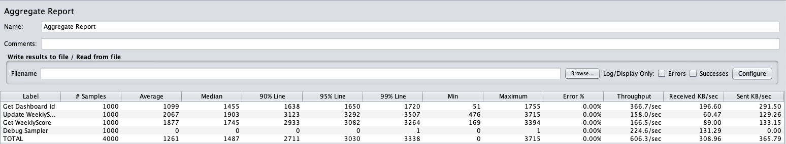
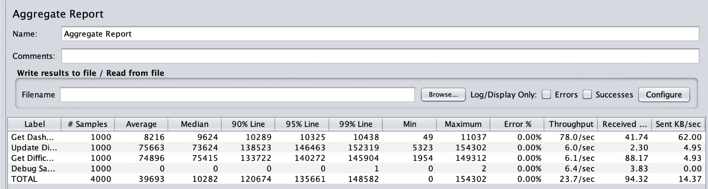

# ES22 P3 submission, Group 28

## Feature PRI

### Subgroup
- Alexandra Rodrigues, Xanatc
    + Issues assigned: [#150](https://github.com/tecnico-softeng-2022/es22-28/issues/150), [#151](https://github.com/tecnico-softeng-2022/es22-28/issues/151), [#152](https://github.com/tecnico-softeng-2022/es22-28/issues/152), [#173](https://github.com/tecnico-softeng-2022/es22-28/issues/173), [#174](https://github.com/tecnico-softeng-2022/es22-28/issues/174), [#175](https://github.com/tecnico-softeng-2022/es22-28/issues/175), [#179](https://github.com/tecnico-softeng-2022/es22-28/issues/179), [#180](https://github.com/tecnico-softeng-2022/es22-28/issues/180)
- Alexandra Pato, AlexP-Coding
    + Issues assigned: [#148](https://github.com/tecnico-softeng-2022/es22-28/issues/148), [#149](https://github.com/tecnico-softeng-2022/es22-28/issues/149), [#166](https://github.com/tecnico-softeng-2022/es22-28/issues/166), [#167](https://github.com/tecnico-softeng-2022/es22-28/issues/167), [#168](https://github.com/tecnico-softeng-2022/es22-28/issues/168), [#187](https://github.com/tecnico-softeng-2022/es22-28/issues/187), [#188](https://github.com/tecnico-softeng-2022/es22-28/issues/188), [#189](https://github.com/tecnico-softeng-2022/es22-28/issues/189)

### Pull requests associated with this feature

The list of pull requests associated with this feature is:

- [PR #212](https://github.com/tecnico-softeng-2022/es22-28/pull/212)
- [PR #214](https://github.com/tecnico-softeng-2022/es22-28/pull/214)

### JMeter Load test

- Basic Test Screenshot

### Cypress end-to-end test

- [Cypress test](https://github.com/tecnico-softeng-2022/es22-28/tree/develop/frontend/tests/e2e/specs/Dashboard/failedAnswers.js)

---

## Feature ERE

### Subgroup
- Carlos Amaro, 95547, LordKubaya
    + Issues assigned: [#159](https://github.com/tecnico-softeng-2022/es22-28/issues/159), [#160](https://github.com/tecnico-softeng-2022/es22-28/issues/160), [#161](https://github.com/tecnico-softeng-2022/es22-28/issues/161), [#162](https://github.com/tecnico-softeng-2022/es22-28/issues/162), [#169](https://github.com/tecnico-softeng-2022/es22-28/issues/169), [#171](https://github.com/tecnico-softeng-2022/es22-28/issues/171), [#183](https://github.com/tecnico-softeng-2022/es22-28/issues/183), [#184](https://github.com/tecnico-softeng-2022/es22-28/issues/184)
- Miguel Carvalho Pereira, miguelcarvalhopereira
    + Issues assigned: [#170](https://github.com/tecnico-softeng-2022/es22-28/issues/170), [#171](https://github.com/tecnico-softeng-2022/es22-28/issues/171), [#172](https://github.com/tecnico-softeng-2022/es22-28/issues/172), [#184](https://github.com/tecnico-softeng-2022/es22-28/issues/184), [#197](https://github.com/tecnico-softeng-2022/es22-28/issues/197)

### Pull requests associated with this feature

The list of pull requests associated with this feature is:

- [PR #163](https://github.com/tecnico-softeng-2022/es22-28/pull/163)
- [PR #204](https://github.com/tecnico-softeng-2022/es22-28/pull/204)
- [PR #213](https://github.com/tecnico-softeng-2022/es22-28/pull/213)
- [PR #215](https://github.com/tecnico-softeng-2022/es22-28/pull/215)

### JMeter Load test

- Basic Test Screenshot

### Cypress end-to-end test

- [Cypress test](https://github.com/tecnico-softeng-2022/es22-28/tree/develop/frontend/tests/e2e/specs/Dashboard/weeklyScores.js)

---

## Feature PRD

### Subgroup
- Pedro Tavares da Silva, pqts
    + Issues assigned: [#156](https://github.com/tecnico-softeng-2022/es22-28/issues/156), [#157](https://github.com/tecnico-softeng-2022/es22-28/issues/157), [#158](https://github.com/tecnico-softeng-2022/es22-28/issues/158), [#181](https://github.com/tecnico-softeng-2022/es22-28/issues/181), [#193](https://github.com/tecnico-softeng-2022/es22-28/issues/193), [#194](https://github.com/tecnico-softeng-2022/es22-28/issues/194), [#195](https://github.com/tecnico-softeng-2022/es22-28/issues/195), [#196](https://github.com/tecnico-softeng-2022/es22-28/issues/196), [#199](https://github.com/tecnico-softeng-2022/es22-28/issues/199), [#200](https://github.com/tecnico-softeng-2022/es22-28/issues/200), [#205](https://github.com/tecnico-softeng-2022/es22-28/issues/205), [#206](https://github.com/tecnico-softeng-2022/es22-28/issues/206)
- Gonçalo Correia, layko88
    + Issues assigned:

### Pull requests associated with this feature

The list of pull requests associated with this feature is:

- [PR #178](https://github.com/tecnico-softeng-2022/es22-28/pull/178)
- [PR #185](https://github.com/tecnico-softeng-2022/es22-28/pull/185)

### JMeter Load test

- Basic Test Screenshot

### Cypress end-to-end test

- [Cypress test](https://github.com/tecnico-softeng-2022/es22-28/tree/develop/frontend/tests/e2e/specs/Dashboard/difficultQuestions.js)

---
